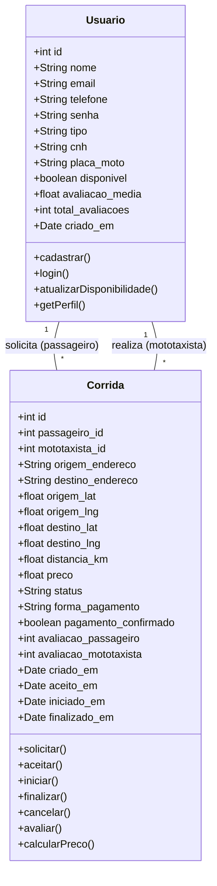
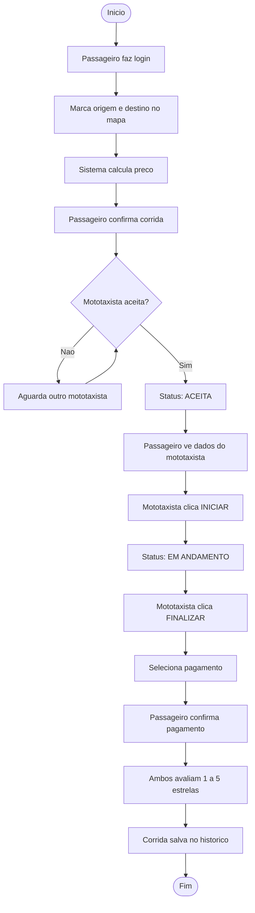
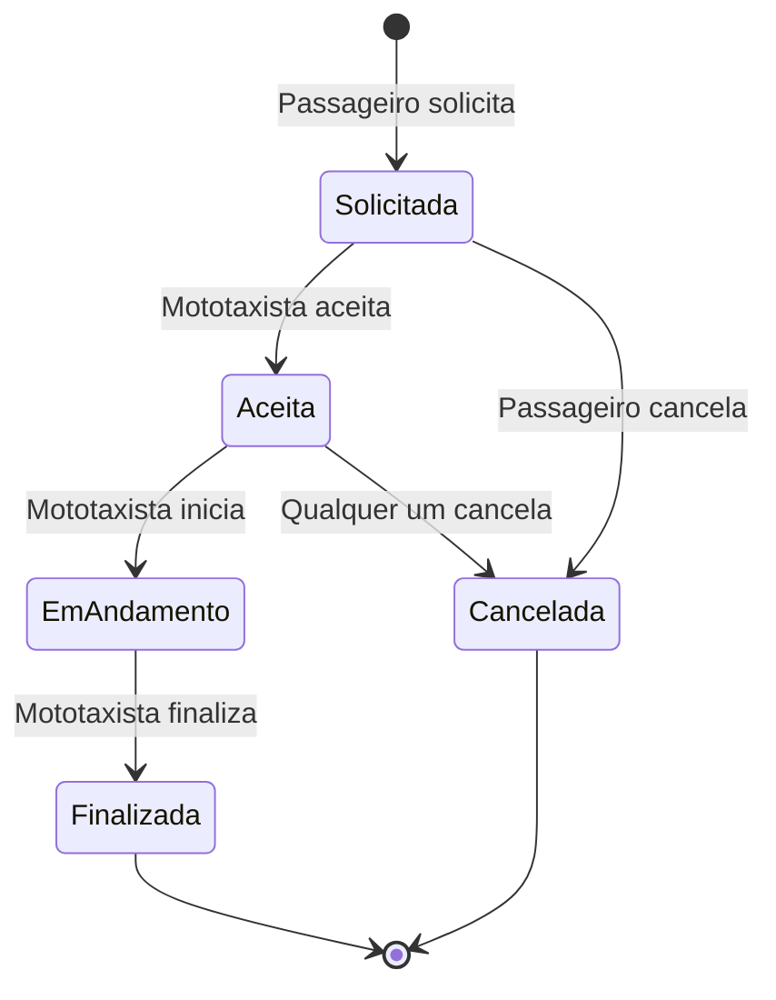

# Diagramas UML - MotoJa

## Diagrama de Casos de Uso

```mermaid
graph TB
    subgraph Sistema MotoJa
        UC1[Cadastrar-se]
        UC2[Fazer Login]
        UC3[Solicitar Corrida]
        UC4[Visualizar Mapa]
        UC5[Acompanhar Status]
        UC6[Escolher Pagamento]
        UC7[Avaliar Mototaxista]
        UC8[Ver Historico]
        UC9[Ver Corridas Disponiveis]
        UC10[Aceitar Corrida]
        UC11[Iniciar Corrida]
        UC12[Finalizar Corrida]
        UC13[Registrar Pagamento]
        UC14[Avaliar Passageiro]
        UC15[Ficar Online/Offline]
    end

    P((Passageiro)) --> UC1
    P --> UC2
    P --> UC3
    P --> UC4
    P --> UC5
    P --> UC6
    P --> UC7
    P --> UC8

    M((Mototaxista)) --> UC1
    M --> UC2
    M --> UC9
    M --> UC10
    M --> UC11
    M --> UC12
    M --> UC13
    M --> UC14
    M --> UC15
```

## Diagrama de Classes

```mermaid
classDiagram
    class Usuario {
        +int id
        +String nome
        +String email
        +String telefone
        +String senha
        +String tipo
        +String cnh
        +String placa_moto
        +boolean disponivel
        +float avaliacao_media
        +int total_avaliacoes
        +Date criado_em
        +cadastrar()
        +login()
        +atualizarDisponibilidade()
        +getPerfil()
    }

    class Corrida {
        +int id
        +int passageiro_id
        +int mototaxista_id
        +String origem_endereco
        +String destino_endereco
        +float origem_lat
        +float origem_lng
        +float destino_lat
        +float destino_lng
        +float distancia_km
        +float preco
        +String status
        +String forma_pagamento
        +boolean pagamento_confirmado
        +int avaliacao_passageiro
        +int avaliacao_mototaxista
        +Date criado_em
        +Date aceito_em
        +Date iniciado_em
        +Date finalizado_em
        +solicitar()
        +aceitar()
        +iniciar()
        +finalizar()
        +cancelar()
        +avaliar()
        +calcularPreco()
    }

    Usuario "1" -- "*" Corrida : solicita (passageiro)
    Usuario "1" -- "*" Corrida : realiza (mototaxista)
```

## Diagrama de Atividades - Fluxo de Corrida

```mermaid
flowchart TD
    A([Inicio]) --> B[Passageiro faz login]
    B --> C[Marca origem e destino no mapa]
    C --> D[Sistema calcula preco]
    D --> E[Passageiro confirma corrida]
    E --> F{Mototaxista aceita?}
    F -->|Nao| G[Aguarda outro mototaxista]
    G --> F
    F -->|Sim| H[Status: ACEITA]
    H --> I[Passageiro ve dados do mototaxista]
    I --> J[Mototaxista clica INICIAR]
    J --> K[Status: EM ANDAMENTO]
    K --> L[Mototaxista clica FINALIZAR]
    L --> M[Seleciona pagamento]
    M --> N[Passageiro confirma pagamento]
    N --> O[Ambos avaliam 1 a 5 estrelas]
    O --> P[Corrida salva no historico]
    P --> Q([Fim])
```

## Diagrama de Estado da Corrida

```mermaid
stateDiagram-v2
    [*] --> Solicitada : Passageiro solicita
    Solicitada --> Aceita : Mototaxista aceita
    Solicitada --> Cancelada : Passageiro cancela
    Aceita --> EmAndamento : Mototaxista inicia
    Aceita --> Cancelada : Qualquer um cancela
    EmAndamento --> Finalizada : Mototaxista finaliza
    Finalizada --> [*]
    Cancelada --> [*]
```
